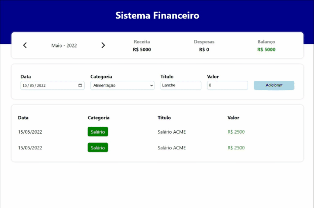
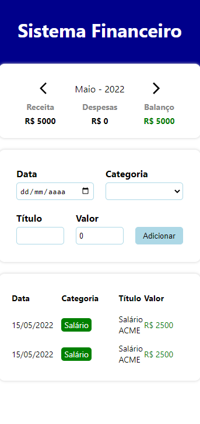

<h1 align="center">
  💻 Projeto
</h1>
<h4 align="center">
  Projeto criado para praticar e elevar conhecimentos de Desenvolvimento Front-end.
</h4>

## 🔎Preview

    

         
    <b>Link do Site:</b> <a target="_blank" href='https://wondrous-granita-7baa32.netlify.app/'>Expense tracker</a>
    

<h5>Desktop</h5>

<h5>Mobile</h5>

---

## 💼 Tecnologias utilizadas

Para o desenvolvimento deste site utilizei as seguintes tecnologias:

- HTML;
- yup (Validador de formulário);
- Styled-components;
- TypeScript;
- React.js
  - useState
  - useEffect

---

## 📋 Descrição

    Projeto feito na participação do curso, do <a href="https://www.youtube.com/channel/UCw9mYSlqKRXI6l4vH-tAYpQ">Bonieky Lacerda</a>. 
Vídeo:<a href="https://www.youtube.com/watch?v=_hytKpMc04E">Sistema de Finanças Pessoais em React (com Typescript) - Projeto 2 - Desafio 5em5 (React)</a>
     

  

Site feito para treinar a criação de layouts com react.js e styled-components, utilizando uma mecânica simples para pegar os valores do formulário e atualizar a lista de receitas do mês, mas os dados são estáticos, não a permanência dos novos dados.

Básicamente oque o projeto faz, é listar os balanços filtrados por mês, que estão na api interna com a opção de criar novas entradas/saídas, ainda não a opção de excluir.

Fiz modificações na ideia original, na validação era feito com ifs, e era apresentado os erros em um alert, fiz um componente, para as notificações de erro e sucesso, e a validação é feita com o yup.

    Site hospedado no Netlify.

#### 🔬Refatoração

​	Não refatorado, necessário refatorar a validação, há um erro quando deixamos o campo valor em branco, ele não reconhece o erro e manda uma menssagem de erro interno para o usúario.

---

## ▶Execução

Comandos necessários:

**npm start:** Sobe o front-end na porta 3000;
